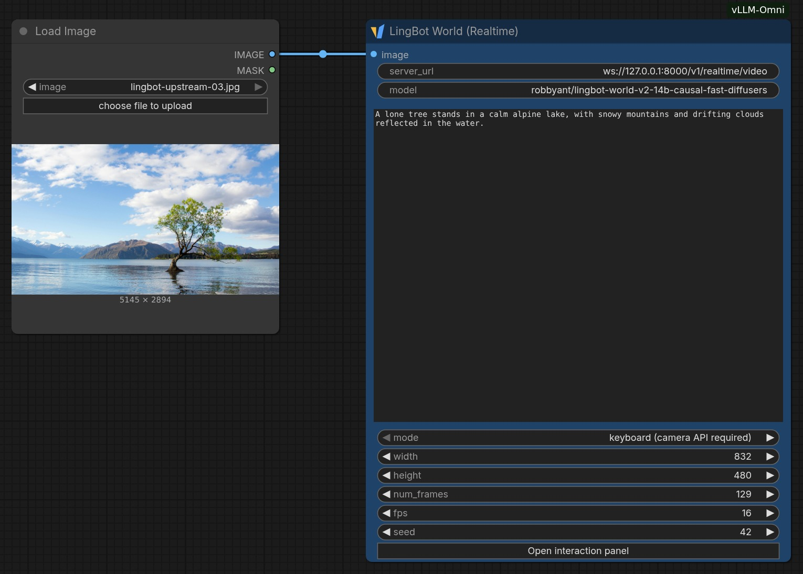
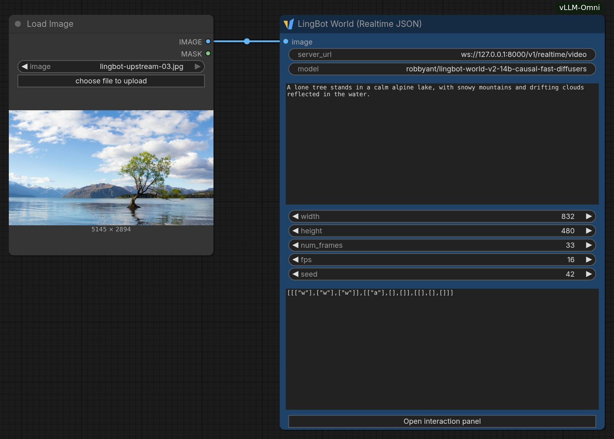
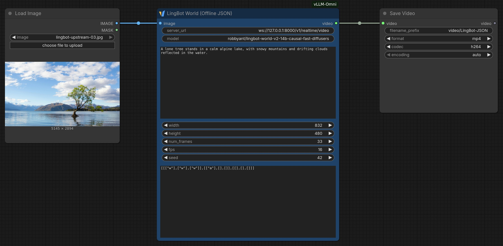

# LingBot World realtime sessions

The **LingBot World (Realtime)** node prepares a first image and settings. Its interaction panel starts one video session, plays fragmented MP4 as it arrives, and sends keyboard camera controls without re-running the workflow. The model runs in vLLM-Omni; ComfyUI can run on CPU.

## Workflow layouts

These are screenshots of the actual ComfyUI graphs using the official [LingBot-World v2 example 03 image](https://github.com/Robbyant/lingbot-world-v2/blob/1895d300d8ac936401689b26389f51cbd36530eb/examples/03/image.jpg). Image source: Robbyant/LingBot-World v2, commit `1895d300d8ac936401689b26389f51cbd36530eb`. They show node connections, not generated video results.

### Keyboard realtime

`Load Image → LingBot World (Realtime)`



### Realtime JSON

`Load Image → LingBot World (Realtime JSON)`



### Offline JSON

`Load Image → LingBot World (Offline JSON) → Save Video`



### Recreate the layouts

1. Install this app and restart ComfyUI. Drag the corresponding LingBot workflow JSON from `example_workflows` onto the canvas, or open it through the workflow menu. Import the JSON workflow, not the documentation JPEG.
2. Download the [upstream first frame](https://raw.githubusercontent.com/Robbyant/lingbot-world-v2/1895d300d8ac936401689b26389f51cbd36530eb/examples/03/image.jpg) as `lingbot-upstream-03.jpg` and upload it in **Load Image**, or select your own first frame. To build the graph manually, double-click an empty canvas area to search for each node. Connect Load Image's `IMAGE` output to the LingBot node's `image` input; for Offline JSON, connect its `VIDEO` output to Save Video's `video` input.
3. Enter the Omni address and prompt. For the JSON variants, paste the trajectory into `camera_json` and match `num_frames` to its chunk count. The supplied JSON examples use 33 frames.
4. Drag node headers to arrange them, resize the nodes to expose their fields, and zoom until all connections fit. Capture the canvas region with a screenshot tool. Creating a structure screenshot does not require running the workflow or loading a model; save the workflow JSON separately to preserve an editable graph.

## Install and serve

Install the parent `ComfyUI-vLLM-Omni` folder following its [README](../README.md). All LingBot node IDs use the `VLLMOmni` prefix, including `VLLMOmniLingBotWorld` for keyboard realtime. When migrating from the earlier standalone plugin, use the bundled workflows or replace its old keyboard node with this one.

Start the backend:

```bash
vllm serve robbyant/lingbot-world-v2-14b-causal-fast-diffusers \
  --omni --deploy-config vllm_omni/deploy/lingbot_world_v2_stepwise.yaml \
  --host 127.0.0.1 --port 8000
```

This is the repository's single-GPU configuration; streaming capability alone does not guarantee realtime generation speed. Multi-GPU and performance tuning belong to the backend deployment, not the ComfyUI process. See the [model recipe](../../../recipes/Robbyant/LingBot-World-2.0.md).

Start ComfyUI in its own environment:

```bash
python main.py --cpu --listen 127.0.0.1 --port 8188
```

Do not add `--disable-api-nodes`: its restrictive media policy blocks the `blob:` URLs required by the player. A Chromium browser with H.264 Media Source Extensions is the initial validation target.

## Open and control a world

1. Import [vLLM-Omni LingBot World.json](../example_workflows/vLLM-Omni%20LingBot%20World.json), also available in the app's workflow templates.
2. Select one RGB image in **Load Image** and set the initial prompt. The first image is resized to the requested output dimensions.
3. Keep `width=832`, `height=480` to match the default deploy configuration. Frame count must be `9 + 12k`; the default 129 frames at 16 FPS is about eight seconds.
4. Run the workflow to prepare the request. Run does not start model inference.
5. Click **Open interaction panel** below the seed, then **Start / Restart**. After the first chunk arrives, click the keyboard control area: **WASD** moves, **IJKL** turns.
6. Camera speed defaults to **0.5×**, adjustable from 0.1× to 2×. Releasing keys, leaving the control area, or hiding the page releases movement.
7. **Stop** cancels generation. Closing the panel, deleting the node, or replacing the workflow also closes the session. Restart creates a new world.

Changing node parameters requires another workflow Run. Only one panel is active per browser page; keep this node in the root workflow, outside subgraphs. The keyboard interaction node has no `VIDEO` output; use Offline JSON below for downstream nodes.

`stationary` and `forward` modes use a fixed per-chunk camera script. `keyboard` mode omits that script, allowing live camera updates instead. It uses the structural camera interface documented in the [streaming video protocol](../../../examples/online_serving/streaming_video_generation/README.md#websocket-protocol).

## JSON camera trajectories

Two additional workflows replay a fixed camera script without keyboard input:

- [Realtime JSON](../example_workflows/vLLM-Omni%20LingBot%20World%20Realtime%20JSON.json): Run to prepare the request, then open the panel and click Start to watch streamed video.
- [Offline JSON](../example_workflows/vLLM-Omni%20LingBot%20World%20Offline%20JSON.json): Run to generate the entire video and pass its `VIDEO` output to **Save Video**. Here “offline” means non-interactive full-video output; the model still runs on the Omni service with the same stepwise deploy config above.

Paste the movement JSON into `camera_json`, or connect a STRING containing the JSON. The value is the array sent as `extra_params.camera_action_script`, without an outer object:

```json
[
  [["w"], ["w"], ["w"]],
  [["a"], [], []],
  [[], [], []]
]
```

This 33-frame example moves forward in the first chunk, moves left for one latent step in the second, then holds still. There must be exactly `(num_frames - 9) / 12 + 1` chunks, each containing three action lists. Use W/A/S/D for translation and I/J/K/L for rotation; simultaneous keys share a list, and `[]` means no movement. Keys are case-insensitive. Invalid JSON, unsupported keys and mismatched chunk counts are rejected before connecting. The script uses the backend's action scale; the keyboard panel's speed slider does not change it.

Both JSON nodes submit the complete script at session start. They do not schedule wall-clock `session.interaction` events. Realtime connects from the browser; Offline connects from the ComfyUI process, so set its `server_url` to an address reachable from that process. Offline collects all fragmented MP4 chunks until `session.done`, decodes them using the existing video converter and returns one video; a stopped or disconnected session raises an error instead of returning a partial result. The client sends keepalive messages during initialization and waits up to 30 minutes. Full-video decoding holds frames in CPU memory, so start with the 33-frame example.

## Local and remote connections

The browser connects directly to `server_url`. Use an Omni WebSocket endpoint reachable from the browser's machine. `localhost` and `127.0.0.1` refer to that machine, not the ComfyUI server. HTTPS pages require a `wss://` endpoint.

For SSH access to a remote machine running both services, forward **8188 and 8000**:

```bash
ssh -N -L 8188:127.0.0.1:8188 -L 8000:127.0.0.1:8000 user@server
```

Open ComfyUI at `http://127.0.0.1:8188` and keep `server_url=ws://127.0.0.1:8000/v1/realtime/video`.

## Control and playback contract

The current backend applies `camera.mode=velocity` deltas on the **latent control grid**, not once per output pixel frame. At 16 FPS, 1× means a 0.05-unit translation, 4° pitch or 6° yaw per latent step. The panel scales these values with requested FPS and normalizes diagonal translation. Coordinates remain the backend's local SE3 convention.

In keyboard mode, each chunk's media duration defines an action window. Events before its deadline are integrated across the next chunk's three latent control frames; events at or after the deadline carry to the following chunk. The backend waits for that deadline and earlier queued actions before starting the next chunk, while playback feedback also limits how far generation can lead the player. Controls cannot change frames already generated or buffered. Camera motion is generative, without a game engine's collision guarantees.

The player buffers up to one second before automatically starting playback, allowing the shorter first chunk to bridge into the next one. The startup threshold stays below the playback feedback window; complete short clips start without waiting for more data. Native playback controls and Stop override automatic startup. The player sends `session.ping` every 20 seconds during lazy compilation. It leaves coded-frame eviction to the browser, rather than removing a fixed five-second history window that can destroy long-GOP reference frames. The unappended byte queue remains bounded. Keyboard mode reports the video playhead every 100 ms and requests a 1.25-second generation window. The backend waits before starting another chunk when generated media is at least this far ahead; an in-flight chunk can extend the window by one chunk. Pausing playback therefore stops further generation once this bounded window fills, while keyboard controls and Stop remain available. The backend must support `streaming_buffer_seconds` and `session.playback`; older servers need upgrading before using this keyboard client.

Sessions are finite. There is no open-ended generation mode, reconnect-and-resume, live prompt editing or recording output node. Increasing `num_frames` extends one rollout but does not preserve it after completion. Long-session memory, quality and input-to-display latency need real-model validation.

## CPU checks

From the vLLM-Omni repository, with its test dependencies installed:

```bash
pytest tests/e2e/features/comfyui/test_lingbot_world.py \
  -m 'core_model and cpu' --run-level core_model
```

The pytest suite uses the existing ComfyUI test shims and mocked client transport. It does not require Node.js, a running service, GPU or model weights. These checks do not establish model speed, image quality or long-session stability.

The standalone frontend regression tests are optional and use Node.js 20+:

```bash
node --test tests/e2e/features/comfyui/lingbot_player.test.mjs
```

They cover camera key states, keepalive and media buffering without launching ComfyUI or a browser.

## Real-model validation plan

After CPU checks, start the stepwise service using the command above and import both JSON workflows. Use the same source image, the bundled three-chunk JSON, model checkpoint, 832×480 dimensions, 33 frames, 16 FPS and seed 42 for both runs. Realtime must finish three generation chunks and reach `session.done`; Offline must produce a playable 33-frame video through Save Video, rather than only the final chunk. Inspect the complete forward/left/hold sequence and compare the two decoded videos. No performance or numerical-equivalence claim is made by the CPU tests. These GPU checks remain manual; record the service commit and configuration with the results.
